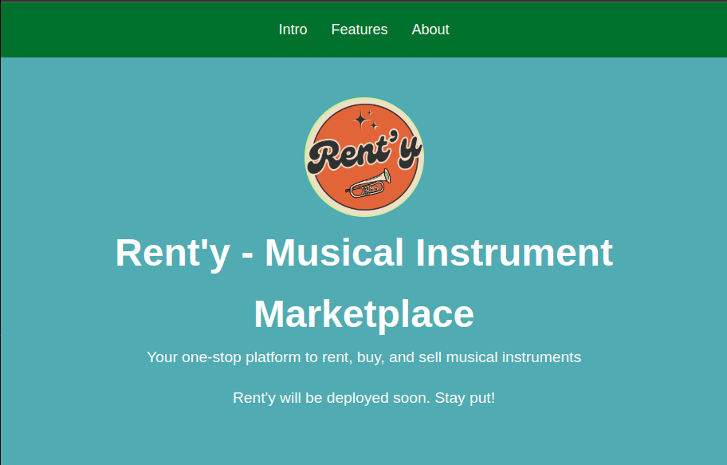
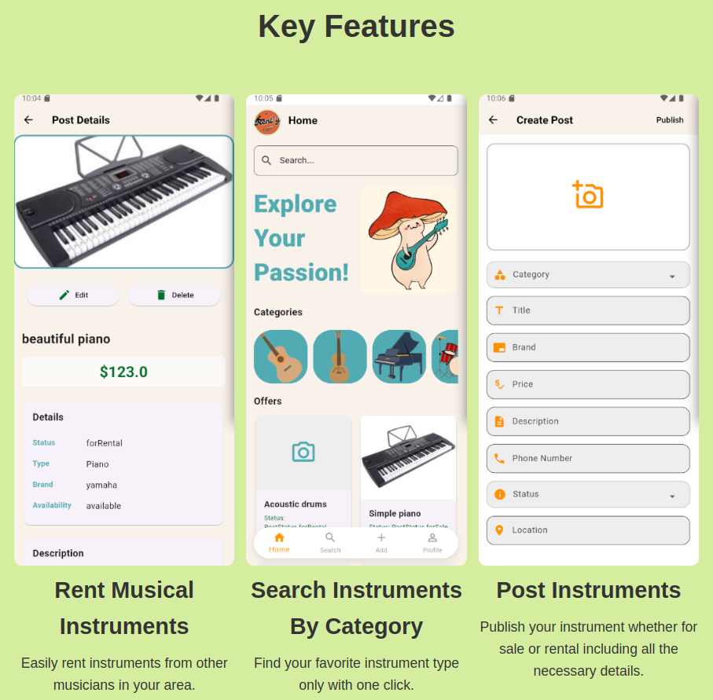
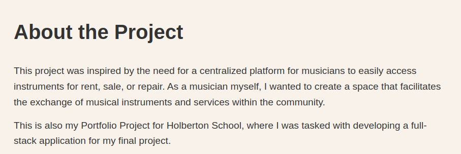

# 🎺 Rent'y - Musical Instrument Marketplace

**Your one-stop platform to rent, buy, and sell musical instruments.**

---

## 🌐 Landing Page Preview

**Rent'y** is a centralized marketplace for musicians to access instruments for rent, sale, or repair. The platform is designed to make musical collaboration and access easier for the entire community.

---

## 🚀 Key Features

- 🎹 **Rent Musical Instruments**  
  Easily rent instruments from other musicians nearby.

- 🔍 **Search by Category**  
  Quickly find your desired instrument by filtering through categories.

- 📤 **Post Instruments**  
  Publish listings for rental or sale by providing essential details.

---

## 📚 About the Project

This project is part of Holberton School’s final curriculum, built as a **full-stack application** to solve a real-world problem faced by musicians. Whether you're a student, professional, or hobbyist, Rent'y aims to improve access to musical instruments through technology.

---

## 📦 Technologies Used

- **Frontend**: Flutter  
- **Backend**: Python (Flask / FastAPI)  
- **Database**: MySQL with SQLAlchemy ORM  

---

## 📬 Contact

For questions, feedback, or collaboration:
 - **Email**: ghofraneamemi04@gmail.com
 - **LinkedIn**: www.linkedin.com/in/ghofrane-amemi-6200a3338